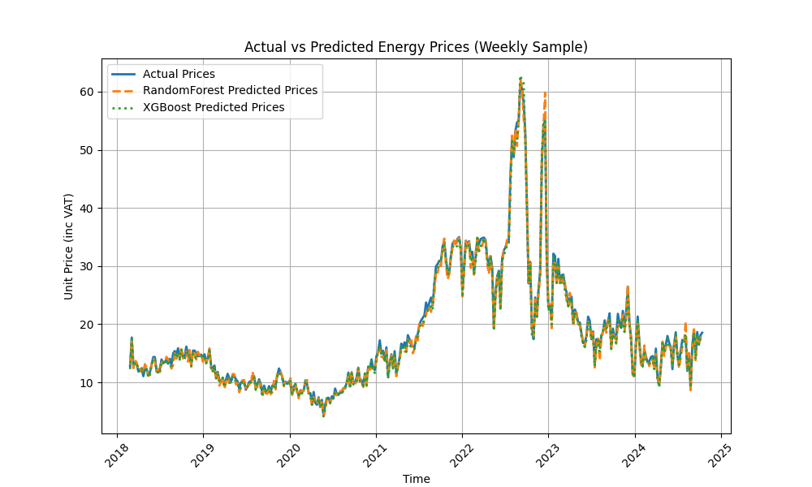

# Energy Price Modelling

This project applies **RandomForest** and **XGBoost** machine learning models to predict energy prices in specific locations in London. The energy price data is collected from a publicly available source, and the project includes the full pipeline for data preprocessing, model training, evaluation, and visualisation of the results.

---

## Table of Contents

1. [Project Overview](#project-overview)
2. [Data Source](#data-source)
3. [Output](#Output)
4. [Running the Project](#running-the-project)
5. [Requirements](#requirements)

---

## Project Overview

The goal of this project is to predict energy prices using machine learning models. The dataset contains historical energy pricing data for a specific area of London. The **RandomForest** and **XGBoost** regressors are used to predict the **Unit Price (inc VAT)** for electricity based on time and location features.

The project workflow involves:
- Preprocessing the raw data (removing unnecessary columns and extracting useful features like time and day of the week).
- Training machine learning models.
- Evaluating model performance.
- Visualising actual vs predicted energy prices.

---

## Data Source

The data used in this project is publicly available from the following sources:
- [Historical Pricing Data - Energy Stats UK](https://energy-stats.uk/download-historical-pricing-data/?_gl=1*17ukjkw*_ga*OTY3NDkxMTIyLjE3Mjg1NTI3MzM.*_ga_M45TVRXZ04*MTcyODU1MjczMi4xLjAuMTcyODU1MjczMi42MC4wLjA.)
- [CSV Data Download Link](https://files.energy-stats.uk/csv_output/)

The dataset includes the following columns:
- **CET Time**: Central European Time (date and time).
- **UK Time (HH:MM)**: Time in the UK timezone.
- **Area Code**: Geographic code for the area.
- **Area Name**: Name of the geographic area.
- **Unit Price**: Energy price in pence per unit.

---

## Output

Here is a plot comparing the actual vs predicted energy prices generated by the model:



The performance of the models is summarised in the evaluation report:

```bash
Performance of RandomForest:
Root Mean Squared Error (RMSE): 2.37
Mean Absolute Error (MAE): 1.39
R-squared: 0.96

Performance of XGBoost:
Root Mean Squared Error (RMSE): 2.20
Mean Absolute Error (MAE): 1.27
R-squared: 0.96

```

---

## Running the Project

### Prerequisites

- **Python 3.9+**
- **pip**: Install the required dependencies using the `requirements.txt` file.

### Setup Instructions

1. Clone the repository:
   ```bash
   git clone https://github.com/yourusername/energy_pricing.git
   cd energy_pricing
   ```

2. Install the dependencies:
   ```bash
   pip install -r requirements.txt
   ```
3. Run the project by executing the main script:
    ```bash
    python src/main.py
    ```

### Requirements
All the necessary Python packages are listed in the requirements.txt file. You can install them using:
   ```bash
pip install -r requirements.txt
  ```
The main dependencies include:
   ```bash

numpy
pandas
matplotlib
scikit-learn
xgboost
  ```

  ## **License**
This project is open-source and available under the [MIT License](LICENSE).
